**BlockGCN:Redefine Topology Awareness for Skeleton- Based Action Recognition**

**2024 CVPR 重新定义基于骨模态行为识别的拓扑感知**

**汇报人 许乙杰**

## **目录**

**研究背景**

**相关工作**

**现存问题**

**实验结果**

**研究方法**

**总结**

## **1.研究背景**

**行为识别是什么**

**行为识别是什么**

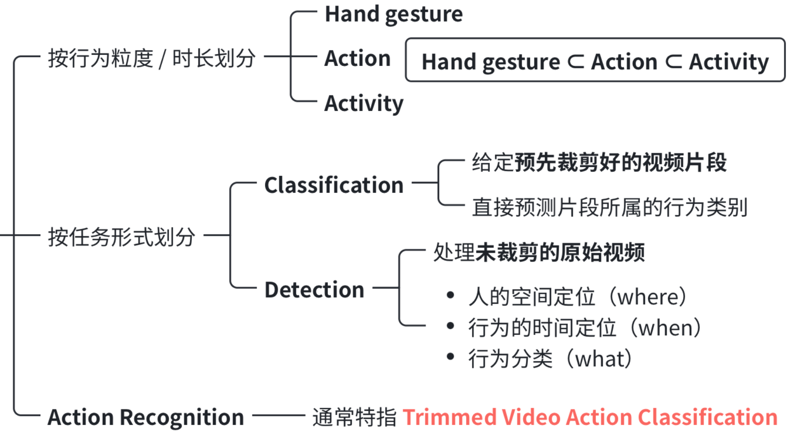

## **行为识别流程**

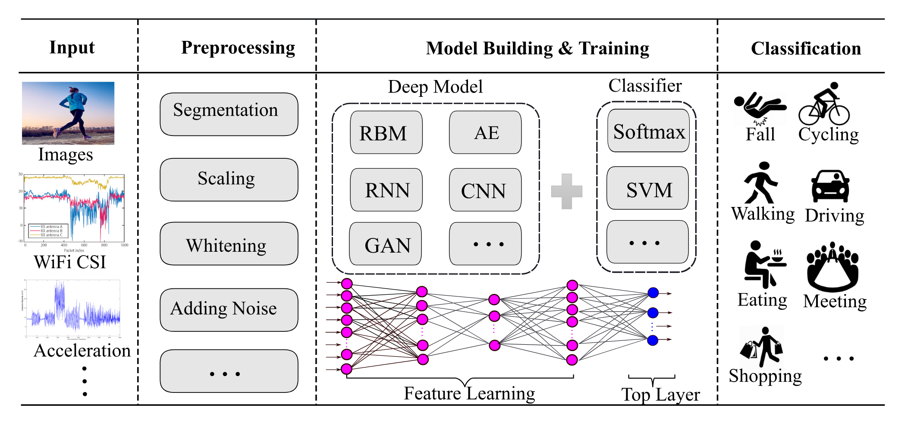

GCN

## **基于骨模态行为识别流程**

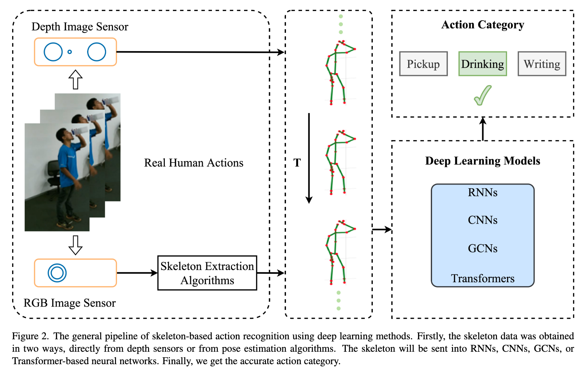

## **为什么用骨模态做行为识别**

### **计算效率高**

### **环境鲁棒性强**

### **隐私风险低**

相比 RGB、光流等模态，骨架数据的计算成本更低，处理起来更高效

受复杂环境、视角变化、身体尺度、运动速度变化的影响更小，识别稳定性更好

骨架数据不会暴露用户的外貌细节，减少了隐私泄露的顾虑

## **2.相关工作**

## **骨模态行为识别工作流**

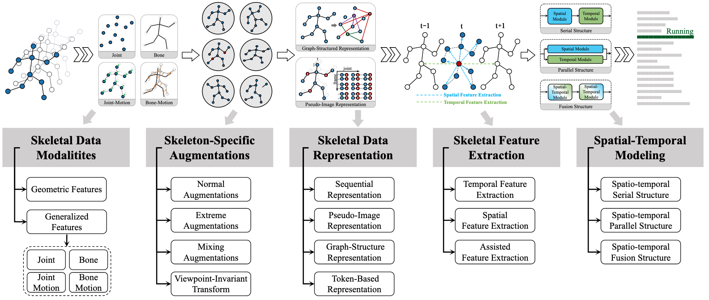

骨架数据→多模态拆分→数据增强→格式转换→特征提取→时空建模→输出动作类别

## **骨模态行为识别特征提取**

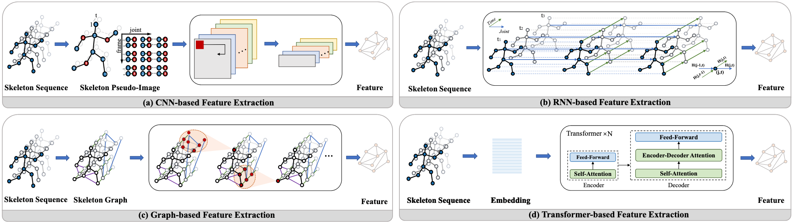

CNN 骨架数据构建为伪图像利用卷积提取时空特征

RNN 骨架视作时序序列循环结构建模动作动态变化

GCN 人体拓扑图结构通过图卷积挖掘关节时空关联

Transformer 骨架转为 Token 依靠自注意力机制捕捉全局远距离依赖

## **骨模态行为识别发展时间线**

BlockGCN

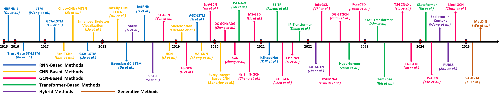

包括：RNN、CNN、 GCN、Transformer、生成式、混合等方法

RNN、CNN难以显式捕捉关节间的空间关联

因此后续研究趋势转向 GCN、Transformer 等方法

## **GCN 骨模态行为识别研究现状**

**邻接矩阵**

**相对位置编码**

**多关系建模**

固定拓扑：基于骨骼物理连接定义固定的邻接矩阵

可学习拓扑：捕捉物理连接和非连接关节间的关系

存在"灾难性遗忘"问题：骨骼拓扑信息在训练中逐渐被侵蚀

在 NLP 和 CV 被证明有效

对图数据上的Transformer模型有益

但在骨架动作识别领域探索不充分

每层并行使用多个GC

引入注意力机制调整连接权重

计算开销大，参数量大，低效

## **3.现存问题**

## **GCN 问题一：“灾难性遗忘”**

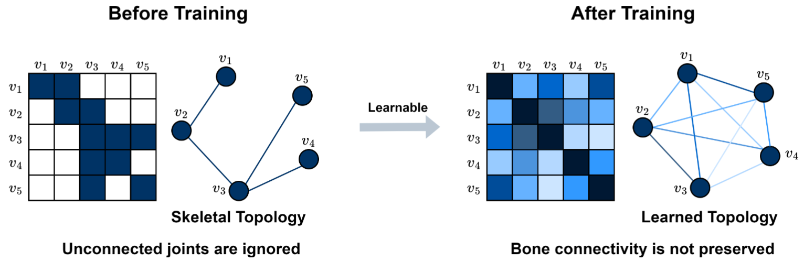

训练前初始化的是符合人体物理结构的骨骼拓扑，但训练结束后，原始的骨骼连接性没有被保留下来，即“灾难性遗忘”

## **GCN 问题二：“低效多关系建模”**

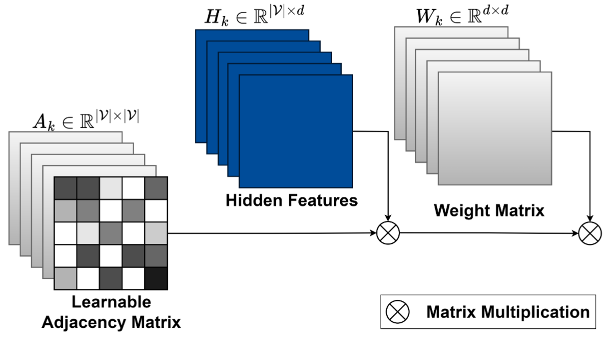

“低效多关系建模”：参数和计算量大，权重矩阵存在大量冗余

## **4.研究方法**

## **BlockGC 模块**

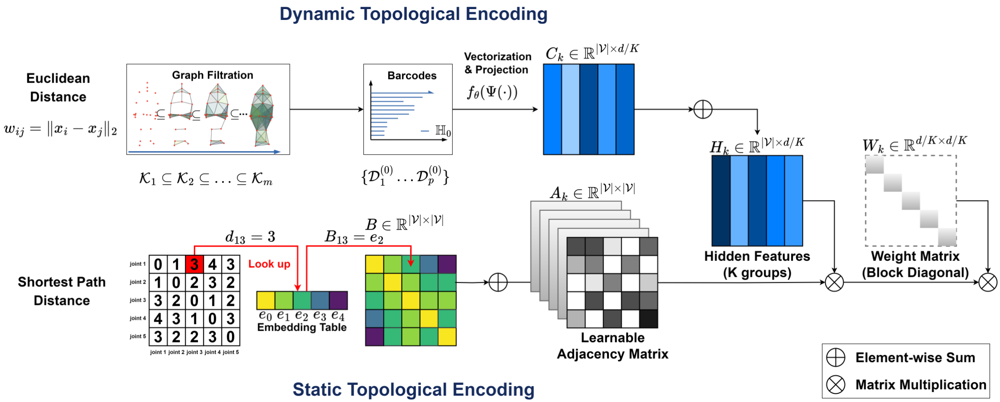

包括拓扑编码（保留骨架结构信息）和分块对角卷积（降低参数量）

## **静态拓扑编码**

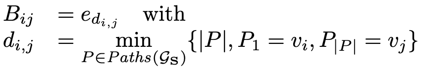

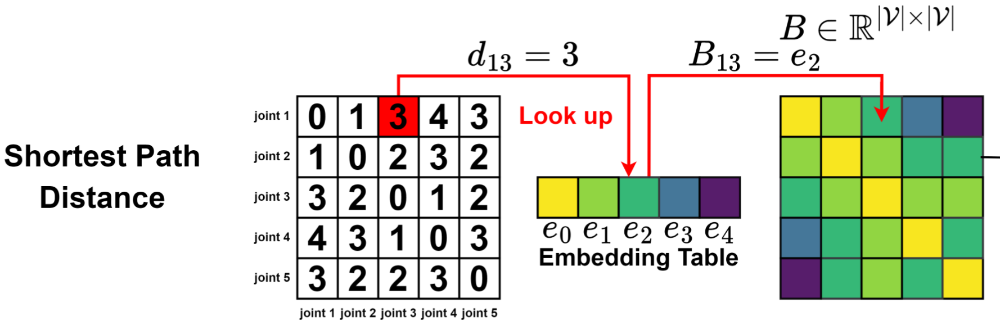

采用骨骼最短路径距离（SPD），通过嵌入表转换成可学习的特征向量，构建出静态拓扑编码矩阵 B，保留物理连接

## **动态拓扑编码**

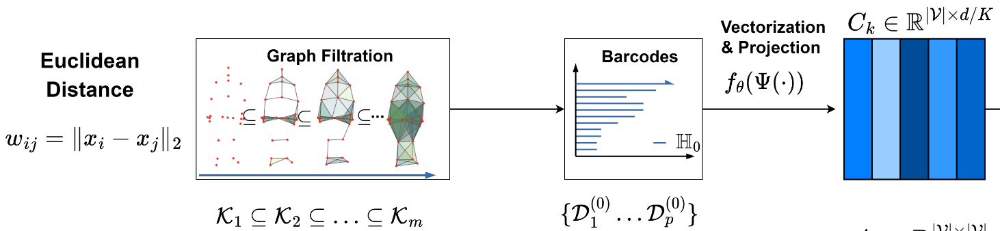

基于关节间欧氏距离构建骨架的过滤序列，提取出随动作变化的拓扑条形码，再通过向量化和投影，得到动作特有的动态拓扑特征

## **动态拓扑编码**

梳头

握手

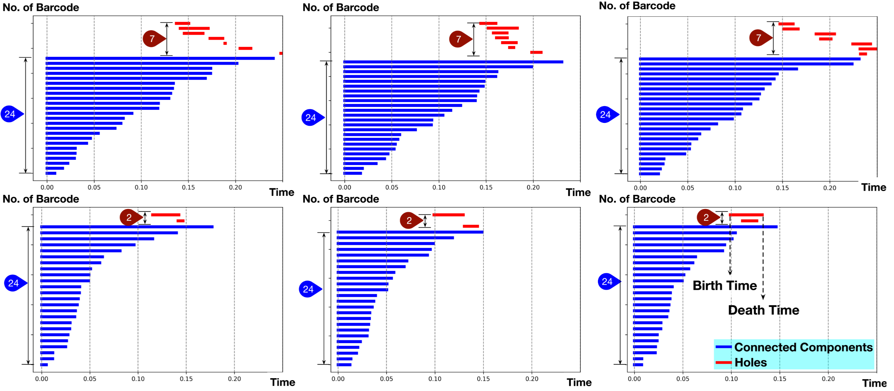

各组样本呈现出明显的类间差异、类内相似特性

## **分块对角卷积**

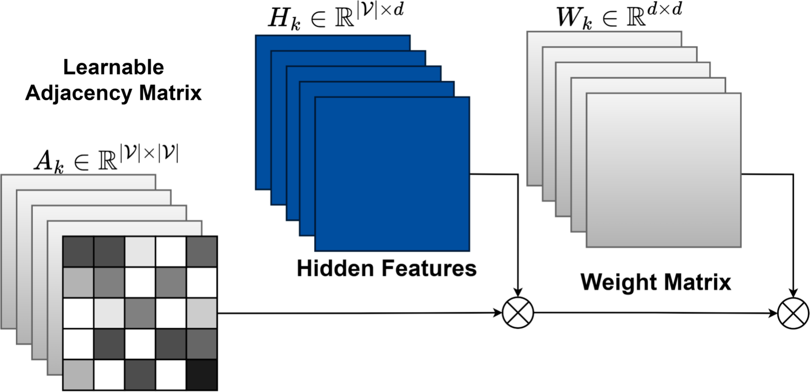

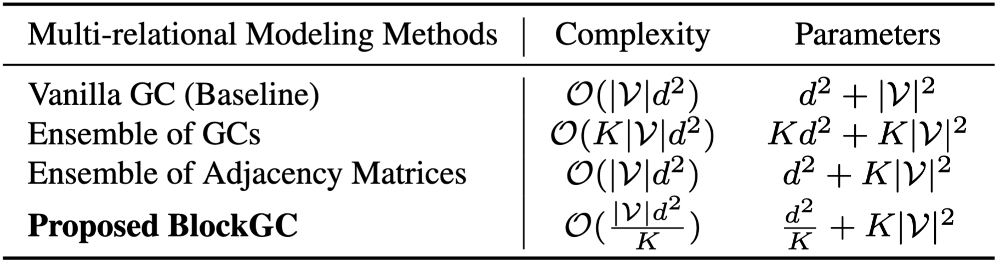

Ensemble of GCs：最朴素的多关系方法，直接堆叠 K 个完全独立的 GC 层

Proposed BlockGC：K 个邻接矩阵 + K 个独立的分块对角权重矩阵

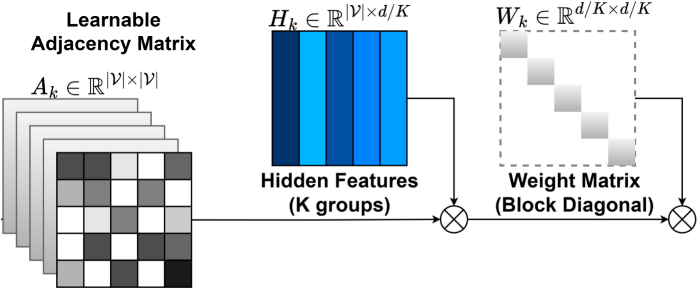

## **分块对角卷积推导**

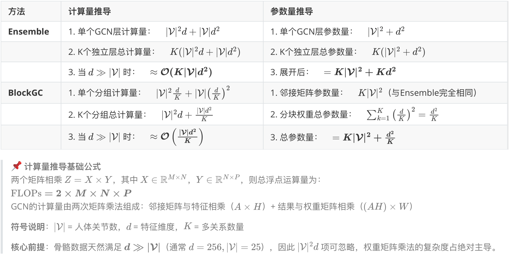

## **分块对角卷积优势**

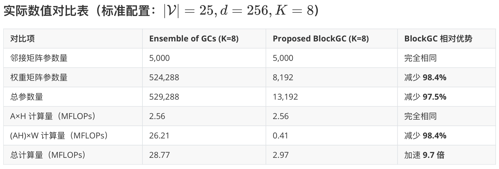

## **BlockGCN 架构**

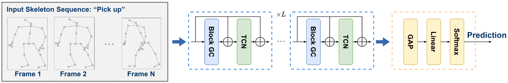

多帧骨架序列→BlockGC→多尺度时间卷积

→全局平均池化→全连接层→Softmax

## **5.实验结果**

## **对比实验**

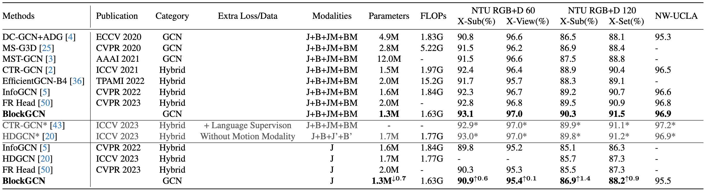

可见该方法不仅在性能上领先，而且在参数量和计算量上都具备优势

## **消融实验1**

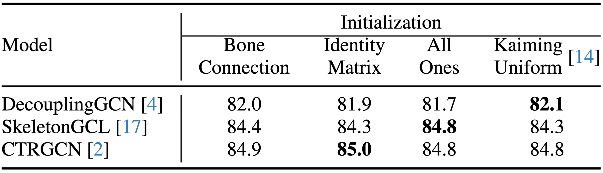

验证模型对邻接矩阵不同初始化具备良好泛化能力，精度不会出现大幅波动。得益于分块卷积设计，单个邻接矩阵匹配专属分块权重矩阵，让模型自主高效学习关节拓扑关联

**消融实验2**

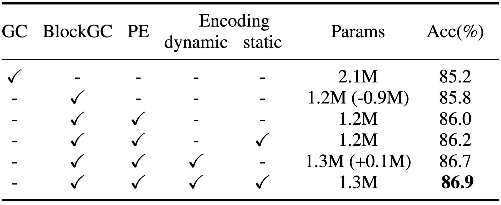

BlockGC 结合动态与静态拓扑编码后，模型准确率提升 1.7%，同时总参数量降低 38%

## **消融实验3**

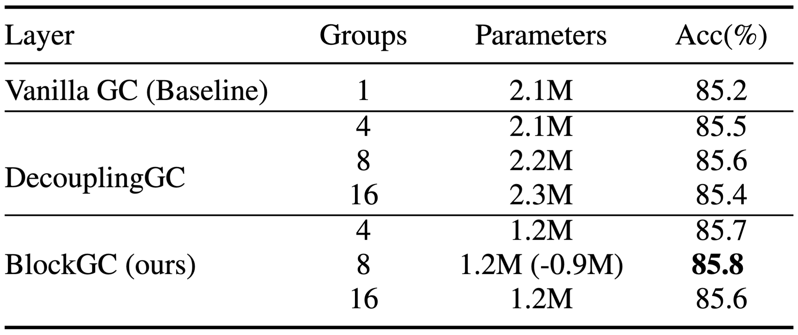

DecouplingGC 随分组数增加参数量膨胀、性能提升有限；

而 BlockGC 在分组 Groups = 8 的时候，实现了参数量减半的同时准确率不降反升

## **6.总结**

问题解决：针对骨架动作识别中 GCN 模型存在的拓扑结构遗忘、多关系建模能力不足两大核心痛点，提出了拓扑编码与 BlockGC 模块

核心成果：BlockGCN 在主流基准上达到了当前最优性能，同时实现了识别精度与计算效率的双重提升

## **谢谢观看**