# BlockGCN: Redefine Topology Awareness for Skeleton-Based Action Recognition

Yuxuan Zhou1† Xudong Yan2† Zhi-Qi Cheng3∗ Yan Yan4 Qi Dai5 Xian-Sheng Hua6 1University of Mannheim 2City University of Macau 3Carnegie Mellon University 4SIAT, Chinese Academy of Sciences 5Microsoft Research 6Terminus Group

https://github.com/ZhouYuxuanYX/BlockGCN

# Abstract

Graph Convolutional Networks (GCNs) have long set the state-of-the-art in skeleton-based action recognition, leveraging their ability to unravel the complex dynamics of human joint topology through the graph’s adjacency matrix. However, an inherent flaw has come to light in these cuttingedge models: they tend to optimize the adjacency matrix jointly with the model weights. This process, while seemingly efficient, causes a gradual decay of bone connectivity data, resulting in a model indifferent to the very topology it sought to represent. To remedy this, we propose a two-fold strategy: (1) We introduce an innovative approach that encodes bone connectivity by harnessing the power of graph distances to describe the physical topology; we further incorporate action-specific topological representation via persistent homology analysis to depict systemic dynamics. This preserves the vital topological nuances often lost in conventional GCNs. (2) Our investigation also reveals the redundancy in existing GCNs for multi-relational modeling, which we address by proposing an efficient refinement to Graph Convolutions (GC) - the BlockGC. This significantly reduces parameters while improving performance beyond original GCNs. Our full model, BlockGCN, establishes new benchmarks in skeleton-based action recognition across all model categories. Its high accuracy and lightweight design, most notably on the large-scale NTU RGB+D 120 dataset, stand as strong validation of the efficacy of BlockGCN.

# 1. Introduction

Skeleton-based action recognition has undergone a significant transformation, driven by the need for computational efficiency and adaptability to varying environmental conditions, particularly in fields such as medical applications. Early pioneering efforts predominantly utilized

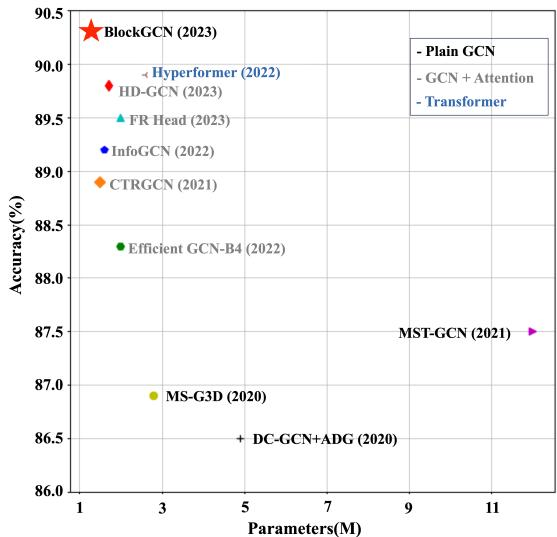

<details>
<summary>scatter</summary>

| Model | Parameters(M) | Accuracy(%) |
| --- | --- | --- |
| BlockGCN (2023) | 1 | 90.5 |
| HD-GCN (2023) | 1.5 | 89.8 |
| FR Head (2023) | 2.5 | 89.5 |
| InfoGCN (2022) | 3 | 89.2 |
| CTRGCN (2021) | 4 | 88.9 |
| Efficient GCN-B4 (2022) | 5 | 88.3 |
| MS-G3D (2020) | 3 | 86.9 |
| DC-GCN+ADG (2020) | 5 | 86.5 |
| MST-GCN (2021) | 11 | 87.5 |
</details>

Figure 1. Performance vs. Model Size on NTU RGB+D 120 Cross-Subject. Our BlockGCN improves over previous methods w.r.t. both performance and efficiency. [Best viewed zoomed in]

Recurrent Neural Networks (RNNs) [9, 35, 47] and Convolutional Neural Networks (CNNs) [18, 24], extracting features or pseudo-images from human joint data to make predictions. Despite reasonable performance, these approaches were inherently constrained in modeling the intricate inter-dependencies between joints, which is crucial for fine-grained action recognition.

Graph Convolutional Networks (GCNs) [7, 19, 31] have the potential to learn the topology, but they fail to fully exploit the inherent skeletal structure due to two key limitations: (1) The topology is initialized based on physical connections, but this vital knowledge decays during training, limiting the retention of skeletal information. (2) The single static topology struggles to capture diverse joint relationships that emerge across complex actions. Therefore, while the graph modeling of GCNs is better suited to handle skeletal data than CNNs or RNNs, they have difficulty fully capturing the intricate multi-scale relationships within the human topology, which are crucial for sophisticated skeletonbased action recognition.

Moreover, the single static graph topology in GCNs has limited expressivity to encapsulate the multi-scale semantic relationships that emerge through the hierarchical representation learning process. Recent advanced methods have sought to mitigate this issue by incorporating learnable topologies with impressive adaptability (e.g., [2, 4]). However, as evidenced by empirical analysis, such techniques still tend to lose valuable topological knowledge acquired from the physical connections during network training. While learnable topologies provide modeling flexibility, vital inductive biases from the inherent skeletal topology are not effectively retained. The enriched semantics captured in the optimized topology tend to deviate from the underlying physical connections, leading to detrimental topological knowledge forgetting.

To remedy the topology fading issue, we propose a novel Topological Encoding approach that represents the skeletal structure through relative distances between joint pairs on the skeletal graph (Sec.3.2). This enables a more robust characterization of the physical connections. Complementing this static encoding, we introduce an actionspecific scheme using persistent homology analysis – the resulting topological descriptor provides vital insights into the skeletal dynamics across actions (Sec.3.2). Furthermore, we demonstrate the redundancy in existing GCNs for multi-relational modeling (Sec. 3.1). To capture substantial joint relationship variations across complex actions, current state-of-the-art GCNs widely adopt ensemble convolutions and attention mechanisms, at the cost of increased computation. To further address this inefficiency, we propose BlockGC, a significant refinement to the standard Graph Convolution (Sec. 3.3). BlockGC proves to be highly effective and efficient for multi-relational reasoning, reducing parameters by over 40% while elevating performance beyond original GCNs. The key contributions of this work are summarized as three-fold:

1. Identifying and restoring the overlooked skeletal topology in advanced GCNs via novel topological encoding schemes. This includes a static encoding using graph distances to retain bone connectivity and a dynamic encoding based on persistent homology to capture actionspecific topology.   
2. Devising BlockGC, an efficient and powerful graph convolutional block that reduces parameters by over 40% while elevating modeling capabilities beyond original GCNs, enabled by its block diagonal weight matrix.   
3. Establishing new state-of-the-art performance on standard benchmarks without reliance on extra supervision or attention. Our method demonstrates consistent improvements averaging over 0.8% in accuracy against previous best-performing approaches.

# 2. Related Work

# 2.1. Skeleton-based Action Recognition

Early approaches to skeleton-based action recognition relied on Recurrent Neural Networks (RNNs) due to their ability to handle temporal dependencies [9, 35, 47]. Convolutional Neural Networks (CNNs) were also employed, but they were found to be less effective in explicitly capturing spatial interactions among body joints [18, 24]. Consequently, the focus shifted to Graph Convolutional Networks (GCNs), which extend convolution operations to non-Euclidean spaces and enable the explicit modeling of joint spatial configurations [13, 44]. In the following, we primarily focus on these graph-based models as they more comprehensively capture spatial relationships.

# 2.2. GCNs for Skeleton-based Action Recognition

Graph Convolutional Networks (GCNs) have significantly impacted skeleton-based action recognition. We discuss previous GCNs in terms of the following aspects:

Adjacency Matrix: The choice of adjacency matrix in GCNs is crucial. Early works, such as [45], used a fixed topology based on bone connectivity, demonstrating the effectiveness of GCNs in action recognition. However, this rigid topology has inherent limitations. Recent approaches have explored learnable adjacency matrices to capture relationships between physically connected and disconnected joints [2, 4, 5, 12, 25, 28, 29, 34, 36, 42]. Our work builds on this idea and addresses the Catastrophic Forgetting associated with learnable adjacency matrices, proposing a method to preserve bone connectivity.

Relative Positional Encodings: Relative positional information has proven important in various domains, including Natural Language Processing [6, 15, 33] and Computer Vision [21, 22, 26, 41, 52]. While relative positional encoding has been demonstrated to be beneficial for Transformers on graph data [46], its significance for GCNs, especially in the field of skeleton-based action recognition, remains unexplored. Our work aims to fill this gap by proposing a novel method for relative positional encoding that preserves the essential topological invariances in skeleton data.

Multi-Relational Modeling: Capturing multiple semantic relations with a single adjacency matrix is challenging. Previous studies have proposed strategies to overcome this limitation. One approach is the ensemble of GCs, as employed by Yan et al. [45], where three parallel GCs at each layer are intended to operate on different partitions of joints according to their distances to a reference node. However, we observed that each adjacency matrix tends to become fully connected after learning, rendering the handcrafted partitions ineffective. This setup is equivalent to ensembling multiple GCs at each layer, a technique adopted in subsequent works [2, 4, 5, 25, 34, 45, 48]. Moreover, DecouplingGCN [4] uses multiple adjacency matrices and a shared weight matrix for different feature subsets, improving efficiency but reducing expressiveness.

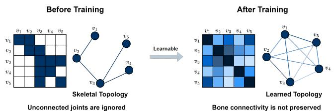

<details>
<summary>flowchart</summary>

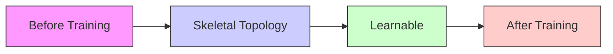
</details>

(a) Skeletal information is lost after training. Darker color is larger weight.

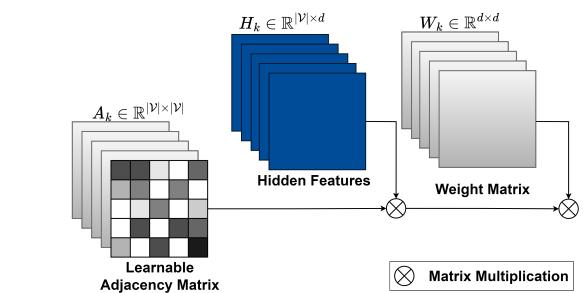

<details>
<summary>flowchart</summary>

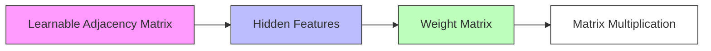
</details>

(b) Ensemble of GCs (default choice of SOTA models).

Figure 2. We reveal the remaining issues of previous GCNs, namely ”catastrophic forgetting” of skeletal topology with learnable topology (see Fig. 2a) and inefficient modeling of multi-relational joint co-occurrences (see Fig. 2b). 

<table><tr><td>Multi-relational Modeling Methods</td><td>Complexity</td><td>Parameters</td></tr><tr><td>Vanilla GC (Baseline)</td><td> $\mathcal{O}(|\mathcal{V}|d^{2})$ </td><td> $d^{2} + |\mathcal{V}|^{2}$ </td></tr><tr><td>Ensemble of GCs</td><td> $\mathcal{O}(K|\mathcal{V}|d^{2})$ </td><td> $Kd^{2} + K|\mathcal{V}|^{2}$ </td></tr><tr><td>Ensemble of Adjacency Matrices</td><td> $\mathcal{O}(|\mathcal{V}|d^{2})$ </td><td> $d^{2} + K|\mathcal{V}|^{2}$ </td></tr><tr><td>Proposed BlockGC</td><td> $\mathcal{O}(\frac{|\mathcal{V}|d^{2}}{K})$ </td><td> $\frac{d^{2}}{K} + K|\mathcal{V}|^{2}$ </td></tr></table>

Table 1. Comparison of different approaches for multi-relational modeling. We denote the number of body joints, the number of hidden dimensions, and the number of groups/ensembles with |V|, d and K respectively, where d is much larger than V. Our BlockGC has the least complexity and parameters but achieves the best performance.

Another approach is attention-based adaptation, as employed in recent works [2, 5, 12, 34, 51], which incorporate attention mechanisms or similar techniques to create a data-dependent component of the topology, similar to Graph Attention Networks [39] and Graphormer [46]. This approach allows for the dynamic adjustment of joint connections based on relevance but is computationally heavy and requires extensive data for optimal performance. In contrast to the above-mentioned approaches, our proposed BlockGC enables the full power of multi-relational modeling by assigning a unique subset of weights to each feature group, while being the most efficient thanks to its sparse convolution weight matrix.

# 3. Method

In this section, we initially compare Graph Convolutional Networks (GCNs) that utilize learnable adjacency matrices with Fully Connected Networks (FCNs). Through a combination of theoretical and experimental analyses, we identify two primary challenges: 1) catastrophic forgetting of skeletal topology and 2) inefficient multi-relational modeling(Sec. 3.1). To combat these limitations, we introduce a series of enhancements: 1) Topology Encoding aimed at retaining key skeleton properties (Sec. 3.2), and 2) an enhanced graph convolution, termed BlockGC, designed to capture the implicit relations within joints at minimum cost (Sec. 3.3). The above innovations lead to the core building block of our Model, as shown in (see Fig. 4a).

# 3.1. Problem Formulation

Within the realm of skeleton-based action recognition, the skeletal topology is inherently defined as a graph $\mathcal { G } _ { S } ~ =$ (V, E), where the vertices V represent the body’s joints, and the edges E illustrate the connections between joints through bones. As a result, nearly all cutting-edge methods [2, 4, 25, 34, 36, 42] consistently adopt the graph convolution proposed by by [19], due to its simplicity and strong resistance to over-fitting:

$$
H ^ {(l)} = \sigma (A ^ {(l)} H ^ {(l - 1)} W ^ {(l)}), \tag {1}
$$

where $A ^ { ( l ) } \in \mathbb { R } ^ { | \mathcal { V } | \times | \mathcal { V } | }$ is the adjacency matrix employed for spatial aggregation, $H ^ { ( l ) } \in \bar { \mathbb { R } } ^ { | \mathcal { V } | \times \bar { T } \times d }$ symbolizes the hidden representation, and $W ^ { ( l ) } \in \mathbb { R } ^ { d \times d }$ is the weight matrix utilized for feature projection. Here, |V|, T , and d denote the number of joints, frames, and hidden features, respectively. σ is the non-linear ReLU activation function, and the superscript l indicates the layer number. Despite GCNs seeming adept at learning human skeleton characteristics effectively, our experimental validation shows that this is not entirely the case. To sum up, there are two main issues in existing GCNs, which will be analyzed below.

P1: Catastrophic Forgetting of skeletal topology: Prior research can generally be categorized into two groups: one [45] where the adjacency matrix is fixed to portray the skeleton topology, and the other [2, 4, 5, 34] where the adjacency matrix is optimized during training via gradient backpropagation1. Despite these advancements, GCNs (Eq. 1) have been observed to struggle with accurate recognition of complex actions [4]. We hypothesize that this performance bottleneck is related to the adjacency matrix A, as it ”catastrophically forgets” the skeleton topology during training.

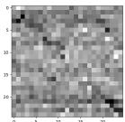  
(a) Mean of A.

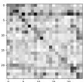  
(b) Std of A.

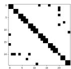  
(c) Bone connections.   
Figure 3. The statistics (mean and standard deviation) of the learned adjacency matrices of GCN (Darker colors stand for larger weights). It can be seen that the learned weights vary dramatically among different layers and deviate far from the bone connections, which are used for initialization at the beginning of training.

Our goal is to validate this hypothesis through both theoretical and experimental approaches.

Theoretically, Graph Convolution with a learnable adjacency matrix can be interpreted as a fully connected layer with a weight matrix $W _ { s p a t i a l } \ \in \ \mathbb { R } ^ { | \mathcal { V } | \times | \mathcal { V } | }$ . In this light, GCNs resemble ResMLP [38] and MLP-Mixer [37], which belong to a special type of Fully-Connected-Networks (FCNs) for image classification. Similarly, GCNs with a learnable adjacency matrix suffer from catastrophic forgetting [27] as FCNs during training, resulting in the inability to preserve the original topological representation in the adjacency matrix A, see Fig. 2a.

From an experimental perspective, we have rigorously confirmed the catastrophic forgetting of skeleton topology (Tab. 3). Our results demonstrate that GCNs’ performance remains similar irrespective of the initialization states, suggesting that existing GCNs entirely fail to maintain the topological skeleton in the adjacency matrix A.

To validate our analysis that the information of bone connectivity is lost after training. We also examined the learned weights of adjacency matrices at each layer of the GCN baseline model. The statistics are provided in Fig. 3. As shown in the figure, the learned adjacency matrices are totally different from each other at each layer, although they are all initialized according to the bone connections.

P2: Inefficient multi-relational modeling: The interactions between joints are action-dependent. For instance, during running, the movement of hands and feet primarily serves to maintain balance, whereas when removing shoes, hands and feet interact more directly and play a dominant role. Therefore, it is clear that a single adjacency matrix A in a classic GCN (Eq. 1) cannot capture more than one type of interaction.

To overcome this issue, previous work has proposed the use of a layer-wise ensemble of GCs or adjacency matrices (see Fig. 2b) and attention-based adaptation. For ensembles of GCs, both parameters and computation increase linearly with the number of ensembles, causing the model to become excessively large with many ensembles and to suffer from over-fitting. As a result, the number of ensembles is typically limited to three.

For the ensemble of adjacency matrices [4] and attention-based adaptation [2, 5], a single weight matrix is applied across the entire feature dimension, which constrains the modeling capacity. Furthermore, our experimental results demonstrate that a significant portion of the weight matrix is redundant (see Tab. 6).

# 3.2. Topological Encoding

GCNs with trainable adjacency matrices A tend to become insensitive to the underlying skeletal topology, i.e., the bone connections, after training. However, incorporating bone connections is beneficial as they convey substantial information about the action being performed, such as how the bone connections physically constrain joint movements. To address this issue, we introduce a method termed Topological Encoding, which efficiently preserves such static information during training. Additionally, we consider the dynamic topological features of the input pose sequence through persistent homology analysis, which further illustrates the self-organizing dynamics in each action class. These two complementary modules provide rich skeleton descriptions to enhance the representation ability of GCNs. Theoretical explanations and intuitive descriptions of the persistent homology analysis are provided in the supplementary material for further reference.

# 3.2.1 Static Topological Encoding

Bones connect the joints of the human body, physically restricting each joint’s movement during an action. It is crucial to integrate this bone connectivity information to accurately recognize the action. We propose a Static Topological Encoding to describe the skeletal connection. This method encodes the relative distance between two joints on the skeletal graph $\mathcal { G } _ { \mathbf { S } }$ , using different distance measures such as Shortest Path Distance (SPD) or distance in a level structure [8]. We adopt SPD for our final model due to its simplicity.

$$
B _ {i j} = e _ {d _ {i, j}} \quad \text { with }
$$

$$
d _ {i, j} = \min _ {P \in P a t h s (\mathcal {G} _ {\mathbf {S}})} \left\{| P |, P _ {1} = v _ {i}, P _ {| P |} = v _ {j} \right\}, \tag {2}
$$

where $P _ { 1 }$ and $P _ { | P | }$ indicate the first and last vertex on the path P , and the weight parameter $B _ { i j }$ is retrieved from a trainable parameter table $E = \{ e _ { \mathrm { i n d e x } } \}$ and then assigned to each joint pair according to their shortest path distances $d _ { i , j }$ through bone connections, as shown in Fig. 4a. In this way, only the embedding weights, instead of adjacency matrices, are optimized during training, ensuring that the bone connectivity information represented by joint distances is preserved. The learned static topological encoding is shown in Fig. 5. By incorporating the Static Topological Encoding, our model effectively captures the essential structural information of the skeleton, leading to improved action recognition performance.

Dynamic Topological Encoding   
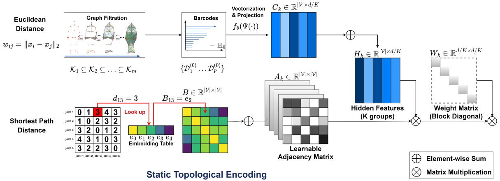

<details>
<summary>flowchart</summary>

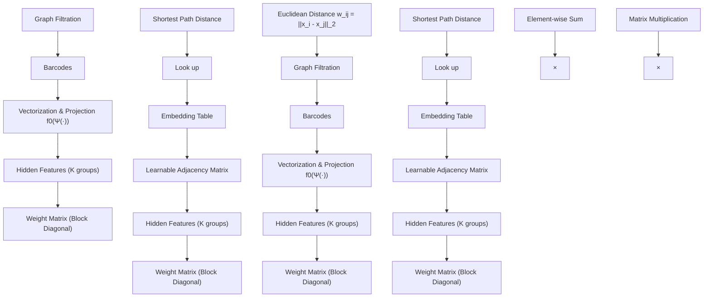
</details>

(a) Illustration of our proposed BlockGC (right) with Topological Encodings (left). Topology Encodings preserve the information of skeletal structure, while BlockGC enables multi-relational modeling, at the same time slashing the redundant convolution weights, thanks to its design of a block diagonal weight matrix. N denotes matrix multiplication.

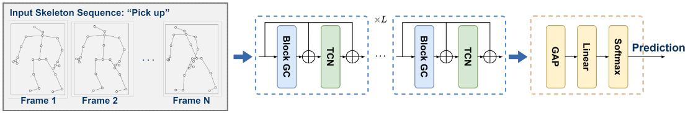

<details>
<summary>flowchart</summary>

```mermaid
graph LR
    subgraph_Input_Skeleton_Sequence["Input Skeleton Sequence: 'Pick up'"]
        A1["Frame 1"] --> B1["Block GC"]
        A2["Frame 2"] --> B2["Block GC"]
        A3["..."] --> B3["Block GC"]
        A4["Frame N"] --> B4["Block GC"]
        B1 --> C1["×L"]
        B2 --> C2["×L"]
        B3 --> C3["×L"]
        B4 --> C4["×L"]
    end

    subgraph ×L_0["×L"]
        D1["Block GC"] --> E1["×L"]
        D2["Block GC"] --> E2["×L"]
        D3["TCN"] --> E3["×L"]
        D4["TCN"] --> E4["×L"]
    end

    subgraph_Prediction["Prediction"]
        F1["GAP"] --> G1["Linear"]
        G1 --> H1["Softmax"]
    end
```
</details>

(b) Model architecture of our BlockGCN. L denotes the number of stacked layers.

Figure 4. Visualization of our proposed approach.   
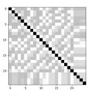  
(a) Layer 1.

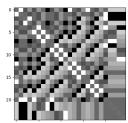  
(b) Layer 2.

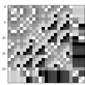  
(c) Layer 3.   
Figure 5. The learned Static Topological Encoding. It shows that the learned weights are diverse and adapted to different levels of semantics at each layer.

# 3.2.2 Dynamic Topological Encoding

The algebraic topology tool of persistent homology [11] was proposed to extract characteristics of topological objects of connected components and cycles of graph persist across multiple scales [1], showing to be efficient in graph representation extraction [30, 49]. By encoding graphs into simplicial complexes, novel descriptors are exposed, which include essential information on action-specific dynamics.

Given an input pose sequence, a weighted dynamic graph $\mathcal { G } _ { \mathbf { D } }$ is composed by using skeleton joints as nodes and the Euclidean distance between each joint pair as weights denoted by $w _ { i j }$ . The key idea for persistent homology analysis is that we consider the filtration of $\mathcal { G } _ { \mathbf { D } } ^ { \epsilon _ { 1 } } \subseteq \mathcal { G } _ { \mathbf { D } } ^ { \epsilon _ { 2 } } \subseteq$ $\dots \mathcal { G } _ { \mathbf { D } } ^ { \epsilon _ { m } } = \mathcal { G }$ instead of a single object of $\mathcal { G } _ { \mathbf { D } }$ . With K representing the abstract simplicial complexes for each graph and ${ \mathcal { K } } _ { i } = { \mathcal { G } } _ { \mathbf { D } } ^ { \epsilon _ { i } }$ (in which $i = 1 , 2 , \dots ,$ m denotes one of the subgraph or subcomplex), the graph filtration is defined as:

$$
\emptyset = \mathcal {K} _ {0} \subseteq \mathcal {K} _ {1} \subseteq \mathcal {K} _ {2} \dots , \subseteq \mathcal {K} _ {m} = \mathcal {K} \tag {3}
$$

We apply Vietoris-Rips complex [1] to build simplicial complexes from the graphs due to its computational advantages. Through the graph filtration construction, the birthdeath barcodes of different topological objects are extracted as summaries of the graph topology. The corresponding persistence diagram of the barcodes is presented as a multiset in $\mathbb { R } ^ { 2 }$ of $\{ \bar { \mathcal { D } } _ { 1 } ^ { 0 } , \mathcal { D } _ { 2 } ^ { 0 } , . . . , \mathcal { D } _ { p } ^ { 0 } \}$ in which $\mathcal { D } _ { i } ^ { 0 } = \{ ( b _ { i } ^ { 0 } , d _ { i } ^ { 0 } ) \}$ and k means the number of connected components (here the superscript 0 denotes the 0-dimensional homology named connected components, while 1-dimensional homology for cycles). As shown in Fig. 6, the obtained barcodes reveal clear inter-action similarities and intra-action differences.

Then we adopt the differentiable vectorization [16] $\Psi ^ { 0 }$ : $\{ \mathcal { D } _ { 1 } ^ { 0 } , \mathcal { D } _ { 2 } ^ { 0 } , . . . , \dot { \mathcal { D } _ { p } ^ { 0 } } \}  \mathbb { R } ^ { | \mathcal { V } | \times d ^ { \prime } }$ on the barcodes, and project the obtained representation to GCN hidden layers’ feature space through a mapping $f _ { \theta } : \mathbb { R } ^ { | \mathcal { V } | \times d ^ { \prime } }  \mathbb { R } ^ { | \mathcal { \bar { V } } | \times d }$ at each layer:

$$
C = f _ {\theta} \left(\Psi^ {0} \left(\mathcal {D} _ {1} ^ {0}, \mathcal {D} _ {2} ^ {0}, \dots , \mathcal {D} _ {p} ^ {0}\right)\right), \tag {4}
$$

where $f _ { \theta }$ is parameterized by a linear layer. The procedure is depicted in Fig. 4a. This encoding is input-dependent and hence termed “dynamic”.

Finally, we add the obtained static and dynamic topological encoding to the adjacency matrix and hidden feature at each layer (the superscript (l) denotes the layer number), respectively, to obtain the final formulation of spatial aggregation:

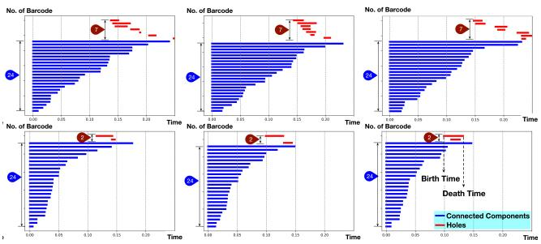

<details>
<summary>bar</summary>

| Time | Connected Components | Holes |
|------|----------------------|-------|
| 0.00 | 0.00                 | 0.00  |
| 0.05 | 0.05                 | 0.00  |
| 0.10 | 0.10                 | 0.00  |
| 0.15 | 0.15                 | 0.00  |
| 0.20 | 0.20                 | 0.00  |
| 0.25 | 0.25                 | 0.00  |
| 0.30 | 0.30                 | 0.00  |
| 0.35 | 0.35                 | 0.00  |
| 0.40 | 0.40                 | 0.00  |
| 0.45 | 0.45                 | 0.00  |
| 0.50 | 0.50                 | 0.00  |
| 0.55 | 0.55                 | 0.00  |
| 0.60 | 0.60                 | 0.00  |
| 0.65 | 0.65                 | 0.00  |
| 0.70 | 0.70                 | 0.00  |
| 0.75 | 0.75                 | 0.00  |
| 0.80 | 0.80                 | 0.00  |
| 0.85 | 0.85                 | 0.00  |
| 0.90 | 0.90                 | 0.00  |
| 0.95 | 0.95                 | 0.00  |
| 1.00 | 1.00                 | 0.00  |
</details>

Figure 6. Barcodes of “brush hair” (top) and “shake hands” (bottom). Large Inter-action similarities and intra-action differences can be observed among different samples in each group.

$$
H ^ {(l)} = \sigma ((A ^ {(l)} + B ^ {(l)}) (H ^ {(l - 1)} + C ^ {(l)}) W ^ {(l)}). \tag {5}
$$

# 3.3. Efficient Multi-Relational Modeling

Joint co-occurrences inherently involve multiple relations, as discussed in Sec. 3.1, which necessitate modeling various semantics. A single adjacency matrix is insufficient to handle such complexity. Previous approaches, detailed in Sec. 2, have limitations in computational efficiency or theoretical constraints, preventing the full potential of GCNs from being realized. To overcome this, we propose BlockGC, which allows efficient modeling of different high-level semantics. Our proposed BlockGC not only reduces computation and parameters but also proves to be more effective than previous methods.

As illustrated in Fig. 4a (top right), the feature dimension is first divided into K groups, and then spatial aggregation and feature projection are applied in parallel within each $k ^ { t h }$ group. The corresponding formula is as follows:

$$
H ^ {(l)} = \sigma (\left[ \begin{array}{c} (A _ {1} + B _ {1}) (H _ {1} ^ {(l - 1)} + C _ {1} ^ {(l - 1)}) \\ \dots \\ (A _ {K} + B _ {K}) (H _ {K} ^ {(l - 1)} + C _ {k} ^ {(l - 1)}) \end{array} \right] \left[ \begin{array}{c c c} W _ {1} ^ {(l)} & & \\ & \dots & \\ & & W _ {K} ^ {(l)} \end{array} \right]) \tag {6}
$$

where $\begin{array} { r l r } { H _ { k } } & { { } \in } & { \mathbb { R } ^ { | \mathcal { V } | \times T \times d / K } } \end{array}$ and $\begin{array} { r l r } { W _ { k } } & { { } \in } & { \mathbb { R } ^ { d / K \times d / K } } \end{array}$ . $\{ W _ { k } , k = 1 , . . . , K \}$ are arranged as a block diagonal matrix, leading to parameter reduction and making the projected feature groups independent from each other. This is a desired property, as each group is intended to model a kind of semantics that are also independent from each other. Thanks to the decoupled feature projection, our method enables GCN the full power for multi-relational modeling. Compared to DecouplingGCN [4] and attention-based adaptation of adjacency matrix, our BlockGC not only significantly reduces parameters and computation (BlockGC $\mathcal { O } ( \frac { | \mathcal { V } | d ^ { 2 } } { K } )$ , GC $\mathcal { O } ( | \nu | d ^ { 2 } )$ , Decoupling GC $\mathcal { O } ( | \nu | d ^ { 2 } ) )$ ), but also leads to improved performance.

# 3.4. Model Architecture

We built our final model, named BlockGCN, based on the above-described Topological Encodings and BlockGC. To model the temporal correlation of the skeleton sequences, we employ the multi-scale temporal convolution module [2, 5, 25]. It consists of three convolution branches with a 1 × 1 convolution for dimension reduction and different combinations of kernel sizes and dilations. The outputs of convolution branches are concatenated as the final output.

The final model is constructed by stacking our BlockGC and the multi-scale temporal convolution modules alternately 10 times as shown in Fig. 4b (the Topological Encodings are omitted for simplification). The final output of our model is produced by applying a global pooling operation over both the joint and temporal dimensions, followed by a softmax operation over the class dimension.

# 4. Experiments

In this section, we comprehensively evaluate our proposed BlockGCN on standard benchmarks for skeleton-based action recognition. Our empirical results showcase that our model exceeds the performance of existing state-of-the-art methods. Furthermore, we present an intricate analysis exploring the significance of topological information within GCN-based models for action recognition. We also carried out an ablation study to assess the efficacy of our novel Topological Encodings and BlockGC. Remarkably, we employ the standard cross-entropy loss in all our experiments to ensure an impartial assessment of our architecture and to uphold direct comparability with prior works. We gauge the performance of our BlockGCN on three widely-used benchmark datasets for skeleton-based human action recognition: NTU RGB+D [32], NTU RGB+D 120 [23], and Northwestern-UCLA [40].

# 4.1. Implementation Details

Our implementation is mainly based on a Tesla V100 GPU. The model was optimized via Stochastic Gradient Descent (SGD) with Nesterov momentum set at 0.9 and a weight decay of 0.0004 for NTU RGB+D and NTU RGB+D 120, and 0.0002 for Northwestern-UCLA. Our experiments employed cross-entropy loss and initiated the learning rate at 0.05, reducing it by a factor of 10 at epochs 110 and 120. For NTU RGB+D and NTU RGB+D 120, we opted for a batch size of 64 and resized each sample to 64 frames. For Northwestern-UCLA, we selected a batch size of 16. Our implementation builds upon the official code [2] and our training setup follows the strategy used in [2, 5].

# 4.2. Comparison with State-of-the-art

To establish a fair comparison, we employed the commonly accepted 4-Stream fusion approach in our experiments. In particular, we input four different modalities:

Table 2. Action classification performance on the NTU RGB+D and NTU RGB+D 120 dataset. Following the common setup, we report results using 4 modalities for a fair comparison. We denote the methods that are not directly comparable with \* (rely on additional supervision signal or change the standard input data) and mark the methods of which the code is unavailable for reproduction with gray. Please refer to Sec. 4.2 for more details. InfoGCN [5] reports their results by ensembling 6 modalities, so we use the reproduced results using 4 modalities by [17] for a fair comparison. In this table, we also omit the results without publicly available code for reproduction. 

<table><tr><td rowspan="2">Methods</td><td rowspan="2">Publication</td><td rowspan="2">Category</td><td rowspan="2">Extra Loss/Data</td><td rowspan="2">Modalities</td><td rowspan="2">Parameters</td><td rowspan="2">FLOPs</td><td colspan="2">NTU RGB+D 60</td><td colspan="2">NTU RGB+D 120</td><td rowspan="2">NW-UCLA</td></tr><tr><td>X-Sub(%)</td><td>X-View(%)</td><td>X-Sub(%)</td><td>X-Set(%)</td></tr><tr><td>DC-GCN+ADG [4]</td><td>ECCV 2020</td><td>GCN</td><td></td><td>J+B+JM+BM</td><td>4.9M</td><td>1.83G</td><td>90.8</td><td>96.6</td><td>86.5</td><td>88.1</td><td>95.3</td></tr><tr><td>MS-G3D [25]</td><td>CVPR 2020</td><td>GCN</td><td></td><td>J+B+JM+BM</td><td>2.8M</td><td>5.22G</td><td>91.5</td><td>96.2</td><td>86.9</td><td>88.4</td><td>-</td></tr><tr><td>MST-GCN [3]</td><td>AAAI 2021</td><td>GCN</td><td></td><td>J+B+JM+BM</td><td>12.0M</td><td>-</td><td>91.5</td><td>96.6</td><td>87.5</td><td>88.8</td><td>-</td></tr><tr><td>CTR-GCN [2]</td><td>ICCV 2021</td><td>Hybrid</td><td></td><td>J+B+JM+BM</td><td>1.5M</td><td>1.97G</td><td>92.4</td><td>96.4</td><td>88.9</td><td>90.4</td><td>96.5</td></tr><tr><td>EfficientGCN-B4 [36]</td><td>TPAMI 2022</td><td>Hybrid</td><td></td><td>J+B+JM+BM</td><td>2.0M</td><td>15.2G</td><td>91.7</td><td>95.7</td><td>88.3</td><td>89.1</td><td>-</td></tr><tr><td>InfoGCN [5]</td><td>CVPR 2022</td><td>Hybrid</td><td></td><td>J+B+JM+BM</td><td>1.6M</td><td>1.84G</td><td>92.3</td><td>96.7</td><td>89.2</td><td>90.7</td><td>96.6</td></tr><tr><td>FR Head [50]</td><td>CVPR 2023</td><td>Hybrid</td><td></td><td>J+B+JM+BM</td><td>2.0M</td><td>-</td><td>92.8</td><td>96.8</td><td>89.5</td><td>90.9</td><td>96.8</td></tr><tr><td>BlockGCN</td><td></td><td>GCN</td><td></td><td>J+B+JM+BM</td><td>1.3M</td><td>1.63G</td><td>93.1</td><td>97.0</td><td>90.3</td><td>91.5</td><td>96.9</td></tr><tr><td>CTR-GCN* [43]</td><td>ICCV 2023</td><td>Hybrid</td><td>+ Language Supervision</td><td>J+B+JM+BM</td><td>-</td><td>-</td><td>92.9*</td><td>97.0*</td><td>89.9*</td><td>91.1*</td><td>97.2*</td></tr><tr><td>HDGCN* [20]</td><td>ICCV 2023</td><td>Hybrid</td><td>Without Motion Modality</td><td>J+B+J&#x27;+B&#x27;</td><td>1.7M</td><td>1.77G</td><td>93.0*</td><td>97.0*</td><td>89.8*</td><td>91.2*</td><td>96.9*</td></tr><tr><td>InfoGCN [5]</td><td>CVPR 2022</td><td>Hybrid</td><td></td><td>J</td><td>1.6M</td><td>1.84G</td><td>89.8</td><td>95.2</td><td>85.1</td><td>86.3</td><td>-</td></tr><tr><td>HDGCN [20]</td><td>ICCV 2023</td><td>Hybrid</td><td></td><td>J</td><td>1.7M</td><td>1.77G</td><td>-</td><td>-</td><td>85.7</td><td>87.3</td><td>-</td></tr><tr><td>FR Head [50]</td><td>CVPR 2023</td><td>Hybrid</td><td></td><td>J</td><td>2.0M</td><td>-</td><td>90.3</td><td>95.3</td><td>85.5</td><td>87.3</td><td>-</td></tr><tr><td>BlockGCN</td><td></td><td>GCN</td><td></td><td>J</td><td> $1.3M^{↓0.7}$ </td><td>1.63G</td><td> $90.9^{\dagger 0.6}$ </td><td> $95.4^{\dagger 0.1}$ </td><td> $86.9^{\dagger 1.4}$ </td><td> $88.2^{\dagger 0.9}$ </td><td>95.5</td></tr></table>

Joint, Bone, Joint Motion, and Bone Motion. The joint and bone modalities denote the original skeleton coordinates and their derivatives with respect to bone connectivity, respectively. The joint and bone motion modalities compute the temporal differential of the joint and bone modalities. Subsequently, we amalgamate the predicted scores of each stream to produce the final fused results. For a fair evaluation, we only consider the results of previous methods (e.g., InfoGCN [5], HDGCN [20]) that utilize four modalities.

We compare our BlockGCN with state-of-the-art methods on NTU RGB+D, NTU RGB+D 120, and Northwestern-UCLA in Tab. 2. It is noteworthy that the recently published works [10, 20, 43] are not directly comparable to our method. PoseC3D [10] achieves improved results by incorporating additional RGB input, but this necessitates significant computational overhead. GAP [43] relies on pre-trained LLMs (GPT-3&CLIP) to leverage the correlations between labels for extra supervision. HDGCN [20] replaces the weaker motion modalities with their handcrafted modalities, which contributes a lot to their final results. As can be seen in the results using joint modality alone, the performance of HDGCN [20] is indeed on par with FR Head [50].

Our BlockGCN establishes new state-of-the-art performance on the common benchmarks, showing an improvement of 0.5% accuracy on average over the previous stateof-the-art FR Head [50]. Notably, this is achieved with 35% fewer parameters. The performance gaps seem mild for all recent approaches mainly because the reported results use an ensemble of 4 modalities. The actual improvement of our method is remarkable (0.8%) when using the single joint modality alone.

Table 3. Ablation on the adjacency matrix initialization. Note that SkeletonGCL [17] proposes a novel framework for training GCNs with additional contrastive loss. 

<table><tr><td rowspan="2">Model</td><td colspan="4">Initialization</td></tr><tr><td>Bone Connection</td><td>Identity Matrix</td><td>All Ones</td><td>Kaiming Uniform [14]</td></tr><tr><td>DecouplingGCN [4]</td><td>82.0</td><td>81.9</td><td>81.7</td><td>82.1</td></tr><tr><td>SkeletonGCL [17]</td><td>84.4</td><td>84.3</td><td>84.8</td><td>84.3</td></tr><tr><td>CTRGCN [2]</td><td>84.9</td><td>85.0</td><td>84.8</td><td>84.8</td></tr></table>

# 4.3. Ablation Analysis

We delve into an experimental evaluation of the effectiveness of each component of our method. All ablation studies are carried out on the X-sub benchmark of NTU RGB+D 120, utilizing a single joint modality, if not specified. We initiate the study by examining the impact of different initializations for the adjacency matrix.

Implications of Adjacency Matrix Initialization: We scrutinize various strategies for initializing the adjacency matrix, ranging from special initialization leveraging physical connections as adopted by previous work, to more topology-agnostic approaches. For this experiment, we engage three different GCNs, as shown in Tab. 3. Our results suggest that simply initializing the adjacency matrix based on physical connections does not suffice to exploit the skeletal topology effectively, thereby inspiring our proposed Topological Encodings to preserve such information.

Effectiveness of Individual Components: We enhance the vanilla GCN baseline by supplanting the vanilla GC with our BlockGC layers and incorporating the topological encodings. Our BlockGC substantially reduces the parameters by 43% (0.9M ), while simultaneously improving the performance. The introduction of dynamic topological encoding marginally increases the parameter count but significantly bolsters performance by 0.7%. By integrating our BlockGC with both topological encodings, we outperform the baseline model by 1.7%, while concurrently reducing the parameters by approximately 38% as listed in Tab. 4.

Table 4. Ablation on BlockGC and Topological Encodings using vanilla GCN as the baseline. PE denotes the learnable absolute positional embedding [5] added to the input pose sequence before the first layer of our network. 

<table><tr><td rowspan="2">GC</td><td rowspan="2">BlockGC</td><td rowspan="2">PE</td><td colspan="2">Encoding</td><td rowspan="2">Params</td><td rowspan="2">Acc(%)</td></tr><tr><td>dynamic</td><td>static</td></tr><tr><td>√</td><td>-</td><td>-</td><td>-</td><td>-</td><td>2.1M</td><td>85.2</td></tr><tr><td>-</td><td>√</td><td>-</td><td>-</td><td>-</td><td>1.2M (-0.9M)</td><td>85.8</td></tr><tr><td>-</td><td>√</td><td>√</td><td>-</td><td>-</td><td>1.2M</td><td>86.0</td></tr><tr><td>-</td><td>√</td><td>√</td><td>-</td><td>√</td><td>1.2M</td><td>86.2</td></tr><tr><td>-</td><td>√</td><td>√</td><td>√</td><td>-</td><td>1.3M (+0.1M)</td><td>86.7</td></tr><tr><td>-</td><td>√</td><td>√</td><td>√</td><td>√</td><td>1.3M</td><td>86.9</td></tr></table>

Shared vs. Feature-wise Encodings: In comparison to a shared encoding for all feature dimensions, feature-wise encoding provides a larger capacity at the expense of an increase in parameters. For our static topological encoding, given the simplicity of the graph distance (discrete and onedimensional), a shared encoding is adequate. Consequently, we simply employ a shared static topological encoding. In contrast, Euclidean distance is continuous and spans three dimensions, necessitating a larger capacity to retain such information. As demonstrated in Tab. 5, the effectiveness of shared dynamic topological encoding is restricted.

Table 5. Feature-wise vs. shared Encoding. 

<table><tr><td>Topological Encoding</td><td colspan="2">Encoding Dimension shared feature-wise</td><td>Acc(%)</td></tr><tr><td rowspan="2">Dynamic</td><td>✓</td><td>-</td><td>86.5</td></tr><tr><td>-</td><td>✓</td><td>86.9</td></tr><tr><td rowspan="2">Static</td><td>✓</td><td>-</td><td>86.9</td></tr><tr><td>-</td><td>✓</td><td>86.7</td></tr></table>

Contrasting BlockGC with DecouplingGC: We pit our BlockGC against DecouplingGC [4] in Tab. 6. As analyzed in Tab. 1, DecouplingGC is essentially using an ensemble of adjacency matrices, which has theoretically larger complexity and more parameters than our BlockGC. Here, we validate the parameter reduction and performance improvement of BlockGC through experiments. Notably, the count of spatial weight parameters inversely correlates with the number of groups, while the number of adjacency matrices increases concurrently. As a result, our BlockGCs with varying groups possess a similar number of parameters. BlockGC significantly trims down the parameters compared to vanilla GC by almost half (43%), yet it still attains a substantial improvement against the baseline (approximately 0.6%). This result is noteworthy as it highlights the redundancy in the extensive parameters in the convolution weight matrix for feature projection and corroborates our analysis in Sec. 3.3 that the decoupling of features across different groups is a beneficial attribute.

Table 6. BlockGC vs. DecouplingGC [4]. 

<table><tr><td>Layer</td><td>Groups</td><td>Parameters</td><td>Acc(%)</td></tr><tr><td>Vanilla GC (Baseline)</td><td>1</td><td>2.1M</td><td>85.2</td></tr><tr><td rowspan="3">DecouplingGC</td><td>4</td><td>2.1M</td><td>85.5</td></tr><tr><td>8</td><td>2.2M</td><td>85.6</td></tr><tr><td>16</td><td>2.3M</td><td>85.4</td></tr><tr><td rowspan="3">BlockGC (ours)</td><td>4</td><td>1.2M</td><td>85.7</td></tr><tr><td>8</td><td>1.2M (-0.9M)</td><td>85.8</td></tr><tr><td>16</td><td>1.2M</td><td>85.6</td></tr></table>

Numbers of Inserted Topological Encoding: We study the effectiveness of the number of layers that are integrated with our topological encoding, and the results are shown in Tab. 7. It shows that repetitively providing the topological information of the input pose sequence to the hidden layers benefits the classification performance.

Table 7. Number of in- Table 8. Impacts of Barcodes’ Vectorserted layers. ization Feature Size. 

<table><tr><td>Layers</td><td>Acc. (%)</td></tr><tr><td>0</td><td>86.0</td></tr><tr><td>1</td><td>86.4</td></tr><tr><td>5</td><td>86.7</td></tr><tr><td>10</td><td>86.9</td></tr></table>

<table><tr><td>Dimension</td><td>Parameters</td><td>Acc. (%)</td></tr><tr><td>32</td><td>1.26M</td><td>86.5</td></tr><tr><td>64</td><td>1.32M</td><td>86.9</td></tr><tr><td>128</td><td>1.44M</td><td>86.4</td></tr></table>

Barcodes’ Vectorization Feature Size: We evaluate the impacts for the dimension of the Barcode vectorization feature (namely d′ as the output of Ψ(·)) (see Tab. 8). The performance improves with increased dimension, and decreases again with the dimension of 128. Therefore, we adopt 64 as the size of the vectorization feature vector.

# 5. Conclusion

This work addresses Catastrophic Forgetting of skeletal topology and insufficient multi-relational modeling capacity in GCNs for skeleton-based action recognition. We introduce Topological Encodings and BlockGC to preserve skeletal topology and efficiently capture multi-relational information, improving performance and efficiency. Block-GCN achieves state-of-the-art results on widely used benchmarks. Future research may explore advancements in topology retention and multi-relational modeling, and their application to other domains with graph-structured data.

Acknowledgments: This work was partially supported by the Air Force Research Laboratory (FA8750-19-2-0200), U.S. Department of Commerce, National Institute of Standards and Technology (60NANB17D156), Intelligence Advanced Research Projects Activity (IARPA) via Department of Interior/Interior Business Center (D17PC00340), and Defense Advanced Research Projects Agency (DARPA) under the GAILA program (HR00111990063).

# References

[1] Mehmet E Aktas, Esra Akbas, and Ahmed El Fatmaoui. Persistence homology of networks: methods and applications. Applied Network Science, 4(1):1–28, 2019. 5   
[2] Yuxin Chen, Ziqi Zhang, Chunfeng Yuan, Bing Li, Ying Deng, and Weiming Hu. Channel-wise topology refinement graph convolution for skeleton-based action recognition. In Proceedings of the IEEE/CVF International Conference on Computer Vision, pages 13359–13368, 2021. 2, 3, 4, 6, 7   
[3] Zhan Chen, Sicheng Li, Bing Yang, Qinghan Li, and Hong Liu. Multi-scale spatial temporal graph convolutional network for skeleton-based action recognition. In Proceedings of the AAAI Conference on Artificial Intelligence, pages 1113–1122, 2021. 7   
[4] Ke Cheng, Yifan Zhang, Congqi Cao, Lei Shi, Jian Cheng, and Hanqing Lu. Decoupling gcn with dropgraph module for skeleton-based action recognition. In European Conference on Computer Vision, pages 536–553, 2020. 2, 3, 4, 6, 7, 8   
[5] Hyung-gun Chi, Myoung Hoon Ha, Seunggeun Chi, Sang Wan Lee, Qixing Huang, and Karthik Ramani. Infogcn: Representation learning for human skeleton-based action recognition. In Proceedings of the IEEE/CVF Conference on Computer Vision and Pattern Recognition, pages 20186–20196, 2022. 2, 3, 4, 6, 7, 8   
[6] Zihang Dai, Zhilin Yang, Yiming Yang, Jaime Carbonell, Quoc V Le, and Ruslan Salakhutdinov. Transformer-xl: Attentive language models beyond a fixed-length context. arXiv preprint arXiv:1901.02860, 2019. 2   
[7] Michael Defferrard, Xavier Bresson, and Pierre Van- ¨ dergheynst. Convolutional neural networks on graphs with fast localized spectral filtering. Advances in Neural Information Processing systems, 29, 2016. 1   
[8] Josep D´ıaz, Jordi Petit, and Maria Serna. A survey of graph layout problems. ACM Computing Surveys (CSUR), 34(3): 313–356, 2002. 4   
[9] Yong Du, Wei Wang, and Liang Wang. Hierarchical recurrent neural network for skeleton based action recognition. In 2015 IEEE Conference on Computer Vision and Pattern Recognition (CVPR), pages 1110–1118, 2015. 1, 2   
[10] Haodong Duan, Yue Zhao, Kai Chen, Dahua Lin, and Bo Dai. Revisiting skeleton-based action recognition. In Proceedings of the IEEE/CVF Conference on Computer Vision and Pattern Recognition, pages 2969–2978, 2022. 7   
[11] Herbert Edelsbrunner. Persistent homology: theory and practice. 2013. 5   
[12] Lingling Gao, Yanli Ji, Yang Yang, and HengTao Shen. Global-local cross-view fisher discrimination for viewinvariant action recognition. In Proceedings of the 30th ACM International Conference on Multimedia, pages 5255–5264, 2022. 2, 3   
[13] Justin Gilmer, Samuel S. Schoenholz, Patrick F. Riley, Oriol Vinyals, and George E. Dahl. Neural message passing for quantum chemistry. In Proceedings of the 34th International Conference on Machine Learning - Volume 70, pages 1263– 1272, 2017. 2   
[14] Kaiming He, Xiangyu Zhang, Shaoqing Ren, and Jian Sun. Delving deep into rectifiers: Surpassing human-level per-

formance on imagenet classification. In Proceedings of the IEEE International Conference on Computer Vision, pages 1026–1034, 2015. 7   
[15] Pengcheng He, Xiaodong Liu, Jianfeng Gao, and Weizhu Chen. Deberta: Decoding-enhanced bert with disentangled attention. arXiv preprint arXiv:2006.03654, 2020. 2   
[16] Christoph Hofer, Florian Graf, Bastian Rieck, Marc Niethammer, and Roland Kwitt. Graph filtration learning. In International Conference on Machine Learning, pages 4314–4323. PMLR, 2020. 5   
[17] Xiaohu Huang, Hao Zhou, Bin Feng, Xinggang Wang, Wenyu Liu, Jian Wang, Haocheng Feng, Junyu Han, Errui Ding, and Jingdong Wang. Graph contrastive learning for skeleton-based action recognition. arXiv preprint arXiv:2301.10900, 2023. 7   
[18] Qiuhong Ke, Mohammed Bennamoun, Senjian An, Ferdous Sohel, and Farid Boussaid. A new representation of skeleton sequences for 3d action recognition. In 2017 IEEE Conference on Computer Vision and Pattern Recognition (CVPR), pages 4570–4579, 2017. 1, 2   
[19] Thomas N. Kipf and Max Welling. Semi-supervised classification with graph convolutional networks. In International Conference on Learning Representations, 2016. 1, 3   
[20] Jungho Lee, Minhyeok Lee, Dogyoon Lee, and Sangyoun Lee. Hierarchically decomposed graph convolutional networks for skeleton-based action recognition. In Proceedings of the IEEE/CVF International Conference on Computer Vision, pages 10444–10453, 2023. 7   
[21] Hao Li, Jinfa Huang, Peng Jin, Guoli Song, Qi Wu, and Jie Chen. Toward 3d spatial reasoning for humanlike text-based visual question answering. arXiv preprint arXiv:2209.10326, 2022. 2   
[22] Hao Li, Jinfa Huang, Peng Jin, Guoli Song, Qi Wu, and Jie Chen. Weakly-supervised 3d spatial reasoning for text-based visual question answering. IEEE Transactions on Image Processing, 2023. 2   
[23] Jun Liu, Amir Shahroudy, Mauricio Perez, Gang Wang, Ling-Yu Duan, and Alex C Kot. Ntu rgb+d 120: A largescale benchmark for 3d human activity understanding. IEEE Transactions on Pattern Analysis and Machine Intelligence, 42(10):2684–2701, 2019. 6   
[24] Mengyuan Liu, Hong Liu, and Chen Chen. Enhanced skeleton visualization for view invariant human action recognition. Pattern Recognition, 68(68):346–362, 2017. 1, 2   
[25] Ziyu Liu, Hongwen Zhang, Zhenghao Chen, Zhiyong Wang, and Wanli Ouyang. Disentangling and unifying graph convolutions for skeleton-based action recognition. In Proceedings of the IEEE/CVF Conference on Computer Vision and Pattern Recognition, pages 143–152, 2020. 2, 3, 6, 7   
[26] Ze Liu, Yutong Lin, Yue Cao, Han Hu, Yixuan Wei, Zheng Zhang, Stephen Lin, and Baining Guo. Swin transformer: Hierarchical vision transformer using shifted windows. In Proceedings of the IEEE/CVF International Conference on Computer Vision, pages 10012–10022, 2021. 2   
[27] German I Parisi, Ronald Kemker, Jose L Part, Christopher Kanan, and Stefan Wermter. Continual lifelong learning with neural networks: A review. Neural Networks, 113:54–71, 2019. 4

[28] Wei Peng, Xiaopeng Hong, Haoyu Chen, and Guoying Zhao. Learning graph convolutional network for skeleton-based human action recognition by neural searching. In Proceedings of the AAAI conference on artificial intelligence, pages 2669–2676, 2020. 2   
[29] Katharina Prasse, Steffen Jung, Yuxuan Zhou, and Margret Keuper. Local spherical harmonics improve skeleton-based hand action recognition. arXiv preprint arXiv:2308.10557, 2023. 2   
[30] Bastian Rieck, Christian Bock, and Karsten Borgwardt. A persistent weisfeiler-lehman procedure for graph classification. In International Conference on Machine Learning, pages 5448–5458. PMLR, 2019. 5   
[31] Michael Schlichtkrull, Thomas N Kipf, Peter Bloem, Rianne Van Den Berg, Ivan Titov, and Max Welling. Modeling relational data with graph convolutional networks. In The Semantic Web: 15th International Conference, ESWC 2018, Heraklion, Crete, Greece, June 3–7, 2018, Proceedings 15, pages 593–607. Springer, 2018. 1   
[32] Amir Shahroudy, Jun Liu, Tian-Tsong Ng, and Gang Wang. Ntu rgb+ d: A large scale dataset for 3d human activity analysis. In Proceedings of the IEEE Conference on Computer Vision and Pattern Recognition, pages 1010–1019, 2016. 6   
[33] Peter Shaw, Jakob Uszkoreit, and Ashish Vaswani. Selfattention with relative position representations. arXiv preprint arXiv:1803.02155, 2018. 2   
[34] Lei Shi, Yifan Zhang, Jian Cheng, and Hanqing Lu. Twostream adaptive graph convolutional networks for skeletonbased action recognition. In 2019 IEEE/CVF Conference on Computer Vision and Pattern Recognition (CVPR), pages 12026–12035, 2019. 2, 3   
[35] Sijie Song, Cuiling Lan, Junliang Xing, Wenjun Zeng, and Jiaying Liu. An end-to-end spatio-temporal attention model for human action recognition from skeleton data. In Proceedings of the AAAI Conference on Artificial Intelligence, 2017. 1, 2   
[36] Yi-Fan Song, Zhang Zhang, Caifeng Shan, and Liang Wang. Constructing stronger and faster baselines for skeleton-based action recognition. arXiv preprint arXiv:2106.15125, 2021. 2, 3, 7   
[37] Ilya Tolstikhin, Neil Houlsby, Alexander Kolesnikov, Lucas Beyer, Xiaohua Zhai, Thomas Unterthiner, Jessica Yung, Daniel Keysers, Jakob Uszkoreit, Mario Lucic, and Alexey Dosovitskiy. Mlp-mixer: An all-mlp architecture for vision. arXiv preprint arXiv:2105.01601, 2021. 4   
[38] Hugo Touvron, Piotr Bojanowski, Mathilde Caron, Matthieu Cord, Alaaeldin El-Nouby, Edouard Grave, Armand Joulin, Gabriel Synnaeve, Jakob Verbeek, and Herve J ´ egou. ´ Resmlp: Feedforward networks for image classification with data-efficient training. arXiv preprint arXiv:2105.03404, 2021. 4   
[39] Petar Velickovi ˇ c, Guillem Cucurull, Arantxa Casanova, ´ Adriana Romero, Pietro Lio, and Yoshua Bengio. Graph attention networks. arXiv preprint arXiv:1710.10903, 2017. 3   
[40] Jiang Wang, Xiaohan Nie, Yin Xia, Ying Wu, and Song-Chun Zhu. Cross-view action modeling, learning and recog-

nition. In Proceedings of the IEEE Conference on Computer Vision and Pattern Recognition, pages 2649–2656, 2014. 6   
[41] Kan Wu, Houwen Peng, Minghao Chen, Jianlong Fu, and Hongyang Chao. Rethinking and improving relative position encoding for vision transformer. In Proceedings of the IEEE/CVF International Conference on Computer Vision, pages 10033–10041, 2021. 2   
[42] Hailun Xia and Xinkai Gao. Multi-scale mixed dense graph convolution network for skeleton-based action recognition. IEEE Access, 9:36475–36484, 2021. 2, 3   
[43] Wangmeng Xiang, Chao Li, Yuxuan Zhou, Biao Wang, and Lei Zhang. Language supervised training for skeleton-based action recognition. arXiv preprint arXiv:2208.05318, 2022. 7   
[44] Keyulu Xu, Weihua Hu, Jure Leskovec, and Stefanie Jegelka. How powerful are graph neural networks. In International Conference on Learning Representations, 2018. 2   
[45] Sijie Yan, Yuanjun Xiong, and Dahua Lin. Spatial temporal graph convolutional networks for skeleton-based action recognition. In AAAI, pages 7444–7452, 2018. 2, 3   
[46] Chengxuan Ying, Tianle Cai, Shengjie Luo, Shuxin Zheng, Guolin Ke, Di He, Yanming Shen, and Tie-Yan Liu. Do transformers really perform badly for graph representation? Advances in Neural Information Processing Systems, 34: 28877–28888, 2021. 2, 3   
[47] Pengfei Zhang, Cuiling Lan, Junliang Xing, Wenjun Zeng, Jianru Xue, and Nanning Zheng. View adaptive recurrent neural networks for high performance human action recognition from skeleton data. In Proceedings of the IEEE International Conference on Computer Vision, pages 2117–2126, 2017. 1, 2   
[48] Pengfei Zhang, Cuiling Lan, Wenjun Zeng, Junliang Xing, Jianru Xue, and Nanning Zheng. Semantics-guided neural networks for efficient skeleton-based human action recognition. In 2020 IEEE/CVF Conference on Computer Vision and Pattern Recognition (CVPR), pages 1112–1121, 2020. 2   
[49] Qi Zhao and Yusu Wang. Learning metrics for persistencebased summaries and applications for graph classification. Advances in Neural Information Processing Systems, 32, 2019. 5   
[50] Huanyu Zhou, Qingjie Liu, and Yunhong Wang. Learning discriminative representations for skeleton based action recognition. In Proceedings of the IEEE/CVF Conference on Computer Vision and Pattern Recognition, pages 10608– 10617, 2023. 7   
[51] Yuxuan Zhou, Zhi-Qi Cheng, Chao Li, Yanwen Fang, Yifeng Geng, Xuansong Xie, and Margret Keuper. Hypergraph transformer for skeleton-based action recognition. arXiv preprint arXiv:2211.09590, 2022. 3   
[52] Yuxuan Zhou, Wangmeng Xiang, Chao Li, Biao Wang, Xihan Wei, Lei Zhang, Margret Keuper, and Xiansheng Hua. Sp-vit: Learning 2d spatial priors for vision transformers. arXiv preprint arXiv:2206.07662, 2022. 2