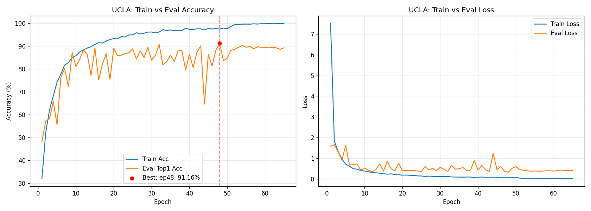
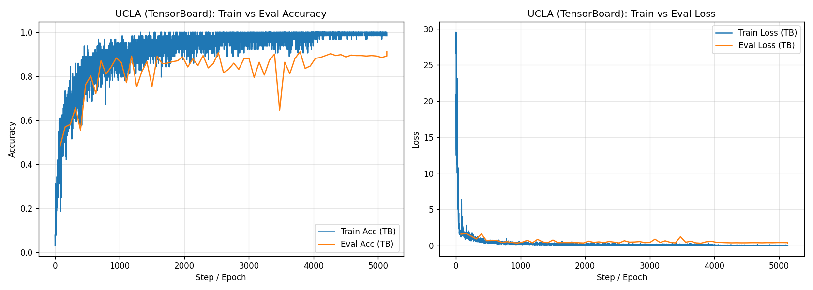
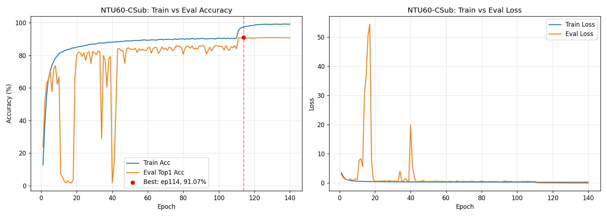

# BlockGCN 训练日志分析报告

> 生成日期: 2026-06-04
> 数据来源:
> - `work_dir/ucla/140_epochs_j/log.txt` + `runs/`
> - `work_dir/ntu60/csub/140_epochs_j/log.txt` + `runs/`

---

## 1. 最佳精度结论

**精度说明**: 下表中的"最佳精度"为**评估集 (Eval / Val) Top-1 准确率**,即每个 epoch 训练完毕后在测试集上跑一遍 forward 得到的分类正确率。日志末尾的 `Best accuracy` 字段也是基于评估集结果记录的,与训练集上的 `training acc` 不是同一指标。

| 数据集 | 最佳 Epoch | Eval Top-1 | 训练总 Epoch | 备注 |
|---|---|---|---|---|
| **NW-UCLA** (joint) | **48** | **91.16%** | 65 | 日志最后一行 `Best accuracy: 0.9116379310344828` |
| **NTU60 CSub** (joint) | **114** | **91.07%** | 140 | 日志最后一行 `Best accuracy: 0.9107175350275974` |

> 注: UCLA 目录名虽然叫 `140_epochs_j`,但实际 config 中 `num_epoch: 65`,只跑了 65 个 epoch;NTU60 跑满 140 epoch。

### 1.1 UCLA: Top-1 ≥ 90% 的 epoch
| Epoch | Top-1 (%) |
|---|---|
| 32 | 90.73 |
| 43 | 90.09 |
| **48** | **91.16** ← 最优 |
| 54 | 90.30 |

### 1.2 NTU60 CSub: Top-1 ≥ 90.9% 的 epoch (后期收敛阶段)
| Epoch | Top-1 (%) |
|---|---|
| 106 | 90.91 |
| 109 | 90.92 |
| 110 | 90.93 |
| 112 | 90.96 |
| 113 | 90.96 |
| **114** | **91.07** ← 最优 |
| 117 | 90.95 |

可以看到 NTU60 在 step LR 衰减 (epoch 110, 120) 之后精度稳定在 90.7~91.1% 区间,而 114 epoch 取得最优。

---

## 2. UCLA 训练曲线对比 (TensorBoard / log)

下图基于 `work_dir/ucla/140_epochs_j/runs/` 中的 TensorBoard event 文件以及 `log.txt` 中按 epoch 聚合后的指标绘制。

### 2.1 按 Epoch 对比 Train vs Eval (Accuracy & Loss)



- **左图 (Accuracy)**: 训练集精度在约 epoch 20 后迅速饱和到 95%+,epoch 50 后接近 99.8%;评估集精度震荡明显,在 **epoch 48 达到峰值 91.16%**(图中红色虚线/红点标注)。曲线之间有明显 gap → **存在过拟合现象**。
- **右图 (Loss)**: 训练 Loss 持续下降至接近 0.01;评估 Loss 在 0.3~0.6 区间震荡,后期(LR 衰减后)趋于平稳。

### 2.2 TensorBoard 原始 scalar 曲线 (Step 级 + Epoch 级)



- TensorBoard 中 `train/acc`、`train/loss` 是 **每个 step (mini-batch)** 都记录一次,共 5135 个点(65 epoch × 79 step/epoch);因此训练曲线呈现高频噪声。
- `val/acc`、`val/loss` 是每个 epoch 记录一次,共 66 个点。

可用以下命令本地启动 TensorBoard 查看交互式视图:

```bash
tensorboard --logdir work_dir/ucla/140_epochs_j/runs
```

---

## 3. NTU60 训练曲线对比 (补充)



- 训练前期 (epoch 14~21) Eval Top-1 出现严重崩溃(掉到个位数 1.6~6%),日志中表现为训练 acc 仍在上升但 eval 完全无效 → 可能是某次重启或不稳定阶段;后续从 epoch 22 恢复正常。
- LR 在 epoch 110 衰减一次后,精度稳定在 90.5~91.1%,在 **epoch 114** 取得 **91.07%** 的最佳值。

---

## 4. 文件清单

本次生成的产物:

| 文件 | 内容 |
|---|---|
| `analyze_logs.py` | 解析 log.txt + 读取 TensorBoard event 的脚本 |
| `ucla_train_vs_eval.png` | UCLA Train vs Eval (Acc/Loss) |
| `ucla_tensorboard.png` | UCLA TensorBoard 原始 scalar 曲线 |
| `ntu60_train_vs_eval.png` | NTU60 CSub Train vs Eval (Acc/Loss) |
| `training_analysis_20260604.md` | 本报告 |
